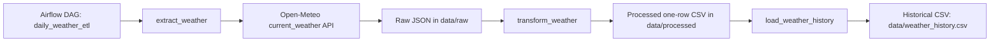

# Airflow Weather ETL

Apache Airflow ETL pipeline that extracts current New York weather from the Open-Meteo API, stores the raw JSON response, transforms it into a one-row CSV record, and appends it to a historical CSV dataset.

## Project Overview

The default configuration uses New York City:

- City: `New York`
- Latitude: `40.7128`
- Longitude: `-74.0060`
- Timezone: `America/New_York`
- API: `https://api.open-meteo.com/v1/forecast`
- Schedule: daily Airflow DAG

## ETL Architecture



## Data Flow

1. `extract.py` requests the Open-Meteo `current_weather` endpoint and validates required fields.
2. The raw response is saved under `data/raw/` with run metadata.
3. `transform.py` converts the nested API response into the CSV schema below.
4. `load.py` appends new run records into `data/weather_history.csv` and skips duplicate run IDs.
5. `dags/weather_etl_dag.py` defines task dependencies only; ETL work does not execute during DAG import.

## Output Schema

| Column | Description |
| --- | --- |
| `run` | Timestamp-based pipeline run ID |
| `city` | Configured city |
| `lat` | Configured latitude |
| `lon` | Configured longitude |
| `extracted_at` | Extraction timestamp in configured timezone |
| `weather_time` | Open-Meteo weather timestamp |
| `temp_c` | Current temperature in Celsius |
| `wind_kmh` | Current wind speed in km/h |
| `wind_deg` | Wind direction in degrees |
| `weather_code` | Open-Meteo weather code |
| `is_day` | Daylight indicator from Open-Meteo |
| `timezone` | API timezone |
| `source` | Data source label |

## Installation

```bash
python -m pip install -e ".[dev]"
```

Install Airflow support locally only when needed:

```bash
python -m pip install -e ".[airflow]"
```

## Environment Configuration

Copy `.env.example` if you want to override defaults:

```bash
cp .env.example .env
```

Supported variables:

- `WEATHER_CITY`
- `WEATHER_LATITUDE`
- `WEATHER_LONGITUDE`
- `WEATHER_TIMEZONE`
- `OPEN_METEO_API_URL`
- `WEATHER_REQUEST_TIMEOUT_SECONDS`
- `WEATHER_DATA_DIR`
- `LOG_LEVEL`

## Airflow Usage

With the package installed, Airflow can parse:

```bash
python -c "import dags.weather_etl_dag"
```

The DAG details are:

- DAG ID: `daily_weather_etl`
- Schedule: `@daily`
- Start date: `2026-01-01` in `America/New_York`
- Retries: `2`
- Retry delay: `1 minute`
- Catchup: `False`

## Docker Compose

Validate the Compose file:

```bash
docker compose config
```

Build the Airflow image:

```bash
docker compose build
```

Start Airflow:

```bash
docker compose up airflow-init airflow-webserver airflow-scheduler
```

Then open the Airflow UI at `http://localhost:8080` and sign in with:

- Username: `admin`
- Password: `admin`

Stop services cleanly:

```bash
docker compose down
```

## Testing

```bash
pytest
```

Tests mock API responses and do not contact the real Open-Meteo service.

## Repository Structure

```text
airflow-weather-etl/
├── dags/
│   └── weather_etl_dag.py
├── src/
│   └── weather_etl/
│       ├── __init__.py
│       ├── extract.py
│       ├── transform.py
│       ├── load.py
│       ├── config.py
│       ├── logging_config.py
│       └── pipeline.py
├── tests/
│   ├── test_dag_import.py
│   ├── test_extract.py
│   ├── test_transform.py
│   └── test_load.py
├── data/
│   ├── raw/
│   └── processed/
├── README.md
├── requirements.txt
├── .env.example
├── .gitignore
├── Dockerfile
├── docker-compose.yml
├── LICENSE
└── pyproject.toml
```
 
